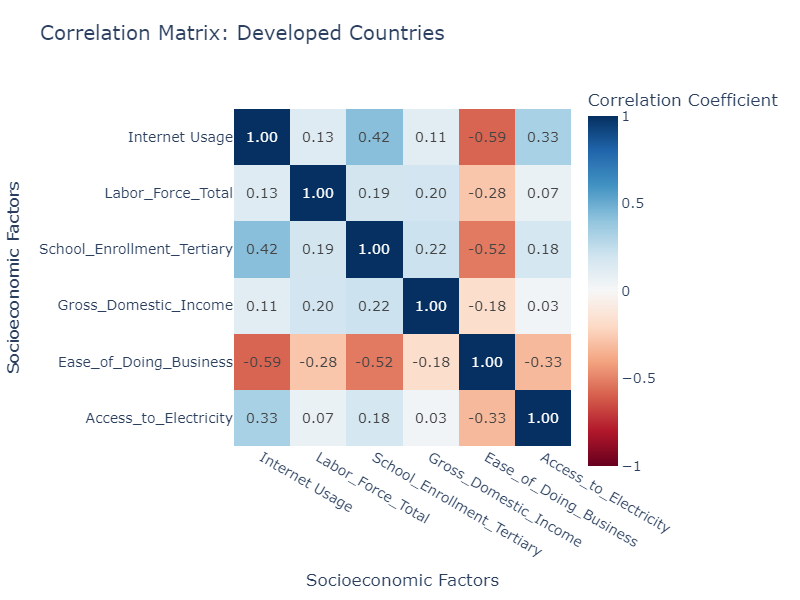
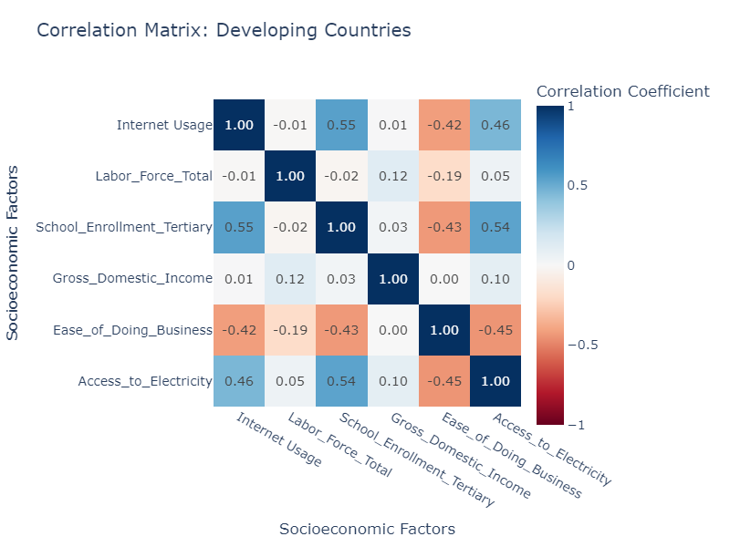
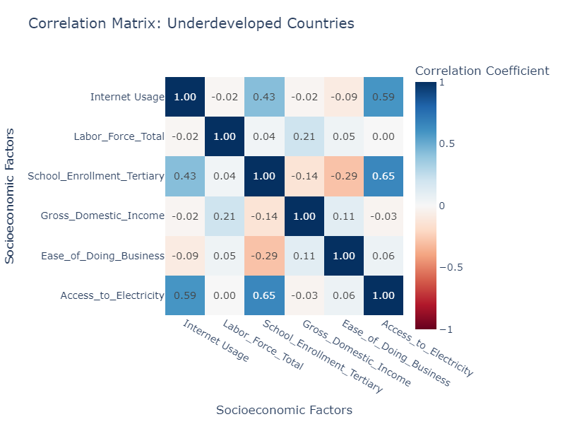
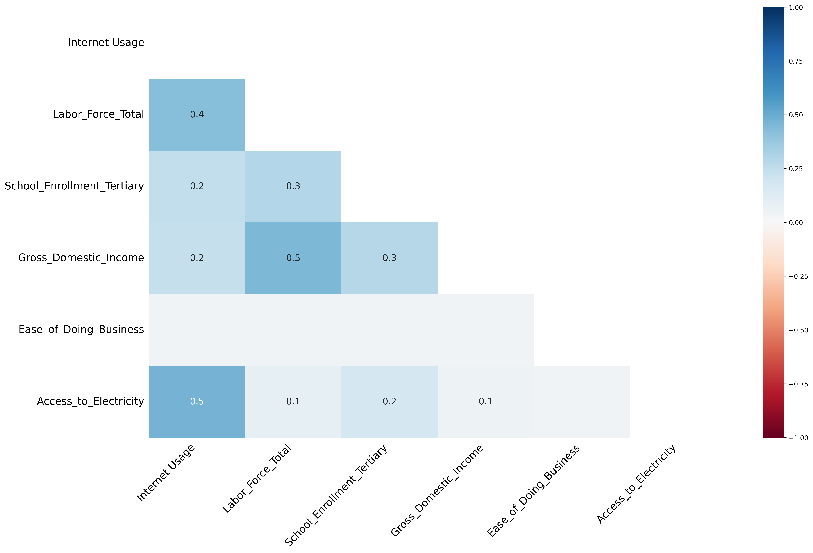
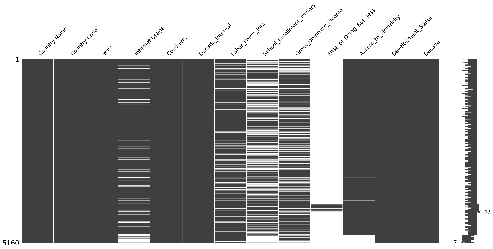
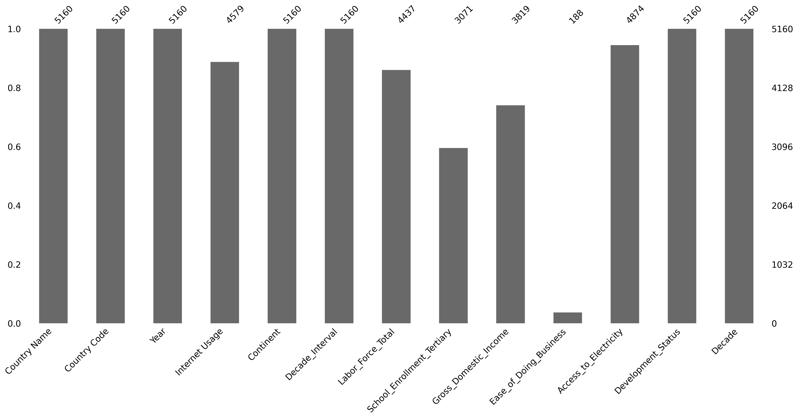
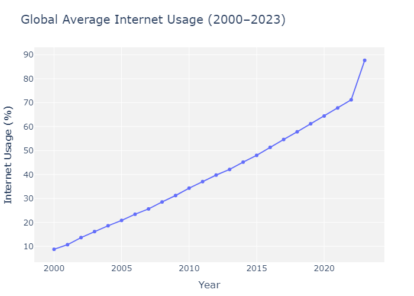
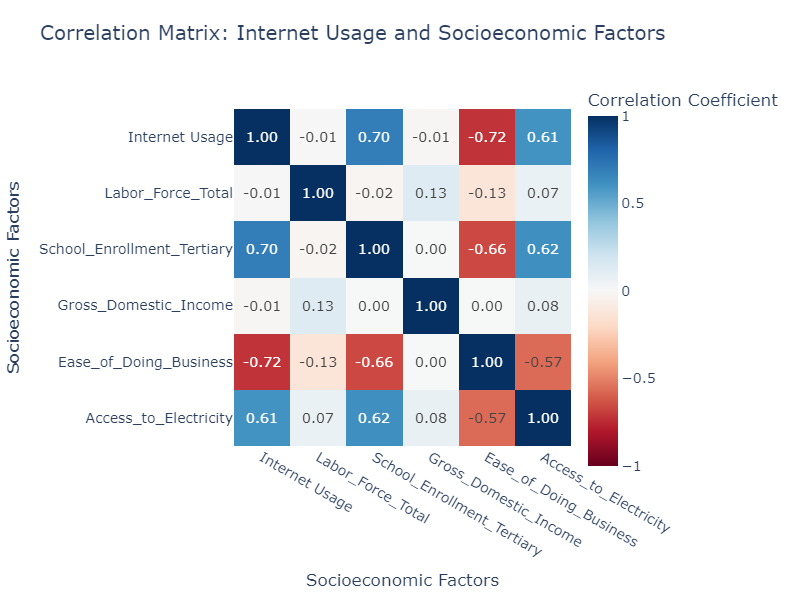
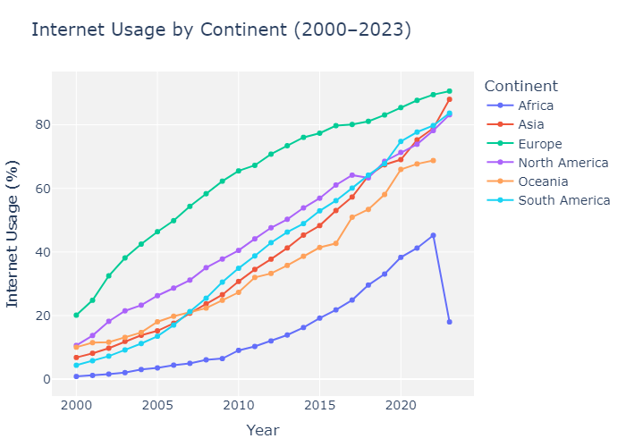
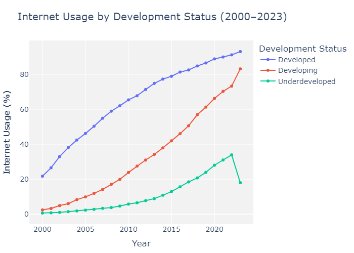

# Table of Contents

- [Introduction](#introduction)
- [💾 Data](#-data)
  - [Interet Usage (`internet_usage.csv`)](#interet-usage-internet_usagecsv)
- [Executive Summary](#executive-summary)
- [Global Trends: Key Observations](#global-trends-key-observations)
  - [Correlations with Education and Electricity](#correlations-with-education-and-electricity)
  - [Developed Countries Lead, But Face Stagnation](#developed-countries-lead-but-face-stagnation)
  - [Developing Countries: The Middle Ground](#developing-countries-the-middle-ground)
  - [Underdeveloped Countries: Challenges in Connectivity](#underdeveloped-countries-challenges-in-connectivity)
- [Statistical Analysis](#statistical-analysis)
  - [Welch's T-Test, Cohen's d, and 95% Confidence Interval](#welchs-t-test-cohens-d-and-95-confidence-interval)
- [Methodology](#methodology)
  - [Data Collection](#data-collection)
  - [Pearson Correlation](#pearson-correlation)
  - [Handling Missing Values](#handling-missing-values)
    - [Ease of Doing Business (96.36% Missing)](#ease-of-doing-business-9636-missing)
    - [School Enrollment (Tertiary) (40.48% Missing)](#school-enrollment-tertiary-4048-missing)
    - [Gross Domestic Income (25.99% Missing)](#gross-domestic-income-2599-missing)
    - [Labor Force Total (14.01% Missing)](#labor-force-total-1401-missing)
    - [Internet Usage (11.26% Missing)](#internet-usage-1126-missing)
    - [Access to Electricity (5.54% Missing)](#access-to-electricity-554-missing)
  - [Statistical Analysis: Welch's T-Test, Cohen's d, and 95% Confidence Interval](#statistical-analysis-welchs-t-test-cohens-d-and-95-confidence-interval)
    - [Welch's T-Test](#welchs-t-test)
    - [Cohen's d](#cohens-d)
    - [95% Confidence Interval](#95-confidence-interval)
- [Insights](#insights)
  - [The Evolution of Global Internet Usage: A Two-Decade Journey](#the-evolution-of-global-internet-usage-a-two-decade-journey)
  - [Regional Disparities: Who's Left Behind?](#regional-disparities-whos-left-behind)
    - [Africa: Still Struggling to Connect](#africa-still-struggling-to-connect)
    - [Asia: A Tale of Two Extremes](#asia-a-tale-of-two-extremes)
    - [Europe: Connected but Complex](#europe-connected-but-complex)
    - [North America: Reaching Saturation](#north-america-reaching-saturation)
    - [South America & Oceania: Still Room to Grow](#south-america--oceania-still-room-to-grow)
  - [Development Status: The Global Digital Divide](#development-status-the-global-digital-divide)
    - [Year-over-Year Growth: Who’s Leading the Charge?](#year-over-year-growth-whos-leading-the-charge)
    - [Where Does the Divide Hit Hardest?](#where-does-the-divide-hit-hardest)
- [Conclusion: A Call to Action](#conclusion-a-call-to-action)
- [Recommendations](#recommendations)
  - [Prioritize Infrastructure Investment in Africa](#prioritize-infrastructure-investment-in-africa)
  - [Focus on Education to Drive Growth in Asia](#focus-on-education-to-drive-growth-in-asia)
  - [Leverage Europe’s High Penetration for Digital Innovation](#leverage-europes-high-penetration-for-digital-innovation)
  - [North America: Focus on Affordability and Speed](#north-america-focus-on-affordability-and-speed)
  - [Target Remote Areas in Oceania and South America](#target-remote-areas-in-oceania-and-south-america)
  - [Support Growing Economies with Better Business Conditions](#support-growing-economies-with-better-business-conditions)
  - [Harness Mobile Internet for Further Expansion in Africa and Developing Countries](#harness-mobile-internet-for-further-expansion-in-africa-and-developing-countries)
  - [Encourage Digital Inclusion Policies in Developing Regions](#encourage-digital-inclusion-policies-in-developing-regions)

# Introduction  
"The internet is becoming the town square for the global village of tomorrow." — Bill Gates. In the year 2000, only **8.8%** of the world population had access to the internet. By 2023, that figure skyrocketed to **87.7%**." This transformation is nothing short of revolutionary. The internet, once a luxury for a select few, has now become a global necessity, driving economies, shaping cultures, and influencing how we live, learn, and work. Yet, these numbers don’t tell the full story. Beneath the surface, disparities in access, economic influence, and education systems paint a much more complex picture of global internet usage. In this report, we will look into global internet adoption, examining correlations with key economic and infrastructural indicators, while breaking down usage trends by continent over the last two decades.  

## 💾 Data

#### You can supplement your data with other sources to enrich your analysis. 

### Interet Usage (`internet_usage.csv`)
|   Column name  |   Description | 
|---------------|-----------|
| Country Name | Name of the country |
| Country Code | Countries 3 character country code|
| 2000 | Contains the % of population of individuals using the internet in 2000  |
| 2001 | Contains the % of population of individuals using the internet in 2001  |
| 2002 | Contains the % of population of individuals using the internet in 2002  |
| 2003 | Contains the % of population of individuals using the internet in 2003  |
| .... | ...  |
| 2023 | Contains the % of population of individuals using the internet in 2023  |

# Executive Summary  
Internet usage has experienced a remarkable surge in the past two decades. From a modest less than 9% in 2000, internet access has catapulted to 87.7% in 2023, a tenfold increase that has revolutionized industries and changed lives across the globe. But behind these impressive figures lies a more nuanced narrative. The relationship between internet usage and economic indicators like the labor force, school enrollment, and access to electricity varies significantly between developed, developing, and underdeveloped countries.

## Global Trends: Key Observations

- **Correlations with Education and Electricity:** On a global scale, internet usage has a strong positive correlation (0.696) with school enrollment at the tertiary level. This finding highlights that countries with higher education rates tend to have greater internet penetration. Similarly, access to electricity also shows a notable positive correlation (0.606), which is a fundamental enabler of connectivity. However, ease of doing business has a negative relationship (-0.724), suggesting that even in countries where business environments are favorable, internet usage may not necessarily follow without proper infrastructure and education.

- **Developed Countries Lead, But Face Stagnation:** Developed nations show a well-established connection between internet usage and tertiary school enrollment (0.422) and access to electricity (0.325). These regions also see a sharp contrast with the ease of doing business (-0.586), indicating that even in technologically advanced economies, other factors, like the cost of living or digital access, might be stifling further growth. Most developed countries have plateaued, where internet access is no longer the primary growth challenge but rather deeper digital inclusivity and sustainable infrastructure.
 
*Showing Developed Countries Correlation Matrix Socioeconomic Factors (2000–2023)*

- **Developing Countries: The Middle Ground:** Developing nations showcase an interesting pattern. While internet usage correlates positively with school enrollment (0.547) and access to electricity (0.458), the ease of doing business still shows a negative correlation (-0.419). This suggests that despite improvements in infrastructure, regulatory challenges still limit the full potential of digital expansion. These countries are in a transition phase, where digital transformation is happening but is uneven and often fragmented.

*Showing Developing Countries Correlation Matrix Socioeconomic Factors (2000–2023)*

- **Underdeveloped Countries: Challenges in Connectivity:** In underdeveloped nations, access to electricity (0.591) remains the strongest enabler of internet growth, whereas school enrollment also shows a positive relationship (0.427). However, labor force participation and ease of doing business show weaker, often negative, correlations. These countries are held back by a lack of foundational infrastructure, highlighting a dire need for investment in both education and electricity to bridge the digital divide.

*Showing Underdeveloped Countries Correlation Matrix Socioeconomic Factors (2000–2023)*

A Welch's T-Test was conducted to compare the mean internet usage between developed and developing countries. The results revealed a statistically significant difference (t=33.8665, p<0.0001). The effect size, measured by Cohen's d, was 1.0930, indicating a very large difference in internet usage between the two groups. Additionally, the 95% confidence interval for the difference in means was [26.7132,29.9962], confirming the robustness of the observed difference.

# Methodology

### Data Collection
Additional socio-economic indicators were fetched using the `wbgapi` Python package, including:

- **Labor Force Total**:  
  The total number of individuals in a country’s labor force, which includes both employed and unemployed individuals who are available and actively seeking work. This metric helps assess the economic capacity and productivity potential of a country.

- **School Enrollment (Tertiary)**:  
  The percentage of individuals enrolled in post-secondary education, including universities, technical institutes, and vocational schools. Higher enrollment in tertiary education is often correlated with better internet usage, as educational institutions are a key driver of digital engagement and literacy.

- **Gross Domestic Income (GDI)**:  
  A measure of the total income earned by a country’s residents, regardless of where that income is produced. It provides insight into the economic power of the population, influencing their ability to access technology and digital services. GDI is often used alongside GDP but focuses on income, indicating the overall economic well-being of the country's residents.

- **Ease of Doing Business**:  
  An index published by the World Bank, ranking countries based on how conducive the regulatory environment is to business operations. A lower (better) ranking indicates simpler and more streamlined business regulations. This metric helps determine whether favorable business conditions in a country correlate with higher levels of internet usage.

- **Access to Electricity**:  
  The percentage of the population that has reliable access to electricity. Access to power is a crucial prerequisite for internet usage, as it enables the operation of devices, networks, and communication systems. This metric is especially important in developing and underdeveloped regions, where electrification rates may be low.

Countries were categorized into three development statuses: **Developed**, **Developing**, and **Underdeveloped**. Furthermore, countries were grouped by continent for regional analysis, allowing for more nuanced exploration of internet usage trends within specific socio-economic contexts.

### Handling Missing Values
Given the percentage of missing values in your dataset, it's clear that some variables have a significant amount of missing data. Below is a detailed plan for handling these missing values based on their extent and importance:

*Table 1: Showing Missing values*

| Variable                    | Missing Percentage | Total Observations | 
|-----------------------------|--------------------|--------------------|
| Internet Usage               | 11.26%             | 5160               | 
| Labor_Force_Total            | 14.01%             | 5160               | 
| School_Enrollment_Tertiary   | 40.48%             | 5160               |
| Gross_Domestic_Income        | 25.99%             | 5160               | 
| Ease_of_Doing_Business       | 96.36%             | 5160               | 
| Access_to_Electricity        | 5.54%              | 5160               | 

*Figure 1.0: Showing Missing values Heatmap*

*Figure 1.1: Showing Missing values Matrix*

*Figure 1.2: Showing Missing values Bar Chart*

Below is the plan for handling missing data in the dataset, based on the percentage of missing values and the importance of each variable.

#### 1. Ease of Doing Business (96.36% Missing)
- **Strategy**: Drop the variable
- With over 96% of the data missing, I decided to drop this variable. Retaining it wouldn’t provide meaningful insights, and it’s unlikely to contribute significantly to the analysis.

#### 2. School Enrollment (Tertiary) (40.48% Missing)
- **Strategy**: Impute using K-Nearest Neighbors (KNN) or Iterative Imputer
- Given the high percentage of missing data, I used advanced imputation techniques, like KNN or Iterative Imputer, to estimate the missing values based on relationships with other variables.

#### 3. Gross Domestic Income (25.99% Missing)
- **Strategy**: Median imputation
- For variables with moderate missingness, I applied median imputation. The median is a robust method that helps reduce the impact of outliers when filling in missing values.

#### 4. Labor Force Total (14.01% Missing)
- **Strategy**: Mean imputation
- With a lower percentage of missing data, I opted for mean imputation. It’s a simple and effective way to handle missing values for this variable.

#### 5. Internet Usage (11.26% Missing)
- **Strategy**: Mean imputation
- Similar to the Labor Force Total, the relatively small percentage of missing data allowed me to use mean imputation to fill in the gaps.

#### 6. Access to Electricity (5.54% Missing)
- **Strategy**: Drop missing rows
- Since only a small amount of data is missing, I chose to drop the rows with missing values for this variable. This should not significantly impact the overall analysis.

### Pearson Correlation

A Pearson correlation was conducted to assess the relationship between internet usage and the socio-economic variables. The Pearson correlation coefficient (r) measures the strength and direction of the linear relationship between two variables. The results indicate:  

- Strong positive correlations exist between internet usage and tertiary school enrollment (r = 0.576, p < 0.0001) and access to electricity (r = 0.590, p < 0.0001).  
- Weak or insignificant correlations were observed for labor force total (r = -0.009, p = 0.531) and gross domestic income (r = -0.007, p = 0.626), suggesting these factors have minimal impact on internet penetration.

*Table Showing Pearson correlation Table*

| Column                      | Pearson Correlation | P-Value  | Significant |
|-----------------------------|---------------------|----------|-------------|
| Labor_Force_Total            | -0.008970           | 0.531253 | No          |
| School_Enrollment_Tertiary   | 0.576296            | 0.000000 | Yes         |
| Gross_Domestic_Income        | -0.006989           | 0.625684 | No          |
| Internet Usage               | 1.000000            | 0.000000 | Yes         |
| Access_to_Electricity        | 0.589702            | 0.000000 | Yes         |

The formula for the Pearson correlation is as follows:

$$
r = \frac{\sum (X_i - \bar{X})(Y_i - \bar{Y})}{\sqrt{\sum (X_i - \bar{X})^2 \sum (Y_i - \bar{Y})^2}}
$$

Where:
- \( X \) represents the values of one variable (e.g., Internet Usage).
- \( Y \) represents the values of the other variable (e.g., Access to Electricity).
- \( \bar{X} \) and \( \bar{Y} \) are the means of \( X \) and \( Y \).

The Pearson correlation coefficient values range between **-1 and 1**, where:
- **1** indicates a **perfect positive relationship**: As one variable increases, the other variable increases proportionally.
- **-1** indicates a **perfect negative relationship**: As one variable increases, the other variable decreases proportionally.
- **0** indicates **no linear relationship** between the two variables.

The closer the coefficient is to **1** or **-1**, the stronger the relationship between the two variables. A positive value indicates that the variables tend to increase together, while a negative value indicates that as one variable increases, the other tends to decrease.

### Statistical Analysis: Welch's T-Test, Cohen's d, and 95% Confidence Interval
A Welch's T-Test was used to compare average internet usage in developed and developing nations. The results showed a statistically significant difference (t=33.8665, p<0.0001). The effect size, as calculated by Cohen's d, was 1.0930, showing a significant difference in internet usage across the groups. Furthermore, the 95% confidence interval for the difference in means was [26.7132,29.9962], indicating the strength of the observed difference.

#### 1. Welch's T-Test
Welch's T-Test, also known as the **unequal variances t-test**, is a statistical test used to compare the means of two independent groups when the assumption of equal variances (homoscedasticity) is violated. Unlike the standard Student's T-Test, Welch's T-Test does not assume that the variances of the two groups are equal, making it more robust in such cases.

#### Formula for Welch's T-Statistic
The formula for Welch's T-Statistic is:

$$
t = \frac{\bar{X}_1 - \bar{X}_2}{\sqrt{\frac{s_1^2}{n_1} + \frac{s_2^2}{n_2}}}
$$

Where:
- $\bar{X}_1$ and $\bar{X}_2$: Sample means of Group 1 and Group 2.
- $s_1^2$ and $s_2^2$: Sample variances of Group 1 and Group 2.
- $n_1$ and $n_2$: Sample sizes of Group 1 and Group 2.

The degrees of freedom ($df$) for Welch's T-Test are calculated using the following formula:

$$
df = \frac{\left(\frac{s_1^2}{n_1} + \frac{s_2^2}{n_2}\right)^2}{\frac{\left(\frac{s_1^2}{n_1}\right)^2}{n_1 - 1} + \frac{\left(\frac{s_2^2}{n_2}\right)^2}{n_2 - 1}}
$$

This adjusted degrees of freedom accounts for the unequal variances and sample sizes.

#### Assumptions of Welch's T-Test
1. **Independence**: The two groups must be independent of each other.
2. **Normality**: Each group should ideally follow a normal distribution. However, Welch's T-Test is robust to moderate deviations from normality, especially with large sample sizes.
3. **Unequal Variances**: This test is specifically designed for situations where the variances of the two groups are unequal.

#### Advantages of Welch's T-Test
- Does not assume equal variances, making it more flexible than the standard T-Test.
- Works well with unequal sample sizes.
- Robust to moderate deviations from normality when sample sizes are large.

### 2. Cohen's d
Cohen's d is a measure of effect size that quantifies the standardized difference between the means of two groups. It provides insight into the magnitude of the difference, independent of sample size.

#### Formula for Cohen's d
The formula for Cohen's d is:

$$
d = \frac{\bar{X}_1 - \bar{X}_2}{s_{\text{pooled}}}
$$

Where:
- $\bar{X}_1$ and $\bar{X}_2$: Sample means of Group 1 and Group 2.
- $s_{\text{pooled}}$: Pooled standard deviation, calculated as:

$$
s_{\text{pooled}} = \sqrt{\frac{(n_1 - 1)s_1^2 + (n_2 - 1)s_2^2}{n_1 + n_2 - 2}}
$$

#### Interpretation of Cohen's d
Cohen's d values can be interpreted as:
- $d = 0.2$: Small effect
- $d = 0.5$: Medium effect
- $d = 0.8$: Large effect

#### Advantages of Cohen's d
- Provides a standardized measure of effect size, allowing comparisons across studies.
- Independent of sample size, making it useful for interpreting practical significance.

### 3. 95% Confidence Interval

A 95% confidence interval provides a range of plausible values for the true difference in means between two groups. It indicates the level of uncertainty around the estimated difference.

#### Formula for 95% Confidence Interval
The formula for the confidence interval is:

$$
\text{CI} = (\bar{X}_1 - \bar{X}_2) \pm t_{\text{critical}} \cdot SE
$$

Where:
- $\bar{X}_1 - \bar{X}_2$: Difference in sample means.
- $t_{\text{critical}}$: Critical value from the t-distribution based on the desired confidence level (e.g., 95%) and degrees of freedom.
- $SE$: Standard error of the difference in means, calculated as:

$$
SE = \sqrt{\frac{s_1^2}{n_1} + \frac{s_2^2}{n_2}}
$$

#### Assumptions for Confidence Intervals
1. **Normality**: The data in each group should ideally follow a normal distribution.
2. **Independence**: Observations in one group should not influence those in the other group.

#### Advantages of Confidence Intervals
- Provides a range of plausible values for the true difference, offering more information than a single p-value.
- Allows for easier interpretation of practical significance.

# Insights

## The Evolution of Global Internet Usage: A Two-Decade Journey  
The pace of internet adoption between 2000 and 2023 has been nothing short of astounding. In 2000, just under **9%** of the global population had access to the internet. Fast forward to 2023, and that number stands at a staggering **87.7%**. What sparked this dramatic increase?  

### Early 2000s  
Internet usage was still in its infancy. Limited infrastructure, high costs, and low accessibility meant that only a small fraction of the global population could connect to the web.  

### Mid-2000s to 2010s  
Advancements in mobile technology, the proliferation of affordable smartphones, and significant improvements in internet infrastructure led to a steep rise in internet usage, particularly in emerging markets.  

### 2020s  
While developed countries have reached a saturation point, largely stabilizing their internet penetration—developing countries continue to see rapid growth as more of their populations come online.  

This exponential growth, however, hides an important story, the growing **digital divide** between regions.

*Figure 2: Showing Internet Usage (2000–2023)*

## Regional Disparities: Who's Left Behind?  
Global internet access isn't uniform, and the disparity is most apparent when we look at specific regions. Let’s break it down:

### Africa: Still Struggling to Connect
In 2000, Africa’s internet penetration was a minuscule 0.8%. Fast forward to 2023, and it’s risen to 45.2%. Impressive? Yes. But when you compare it to the rest of the world, it’s clear that Africa remains far behind. Why? Infrastructure or the lack of it. The correlation between access to electricity and internet usage in Africa is striking (0.6058). No electricity, no internet. It’s that simple.

But here’s where it gets interesting. Mobile internet has been a game-changer. Many African countries have bypassed the need for traditional fixed-line connections and jumped straight to mobile. This leapfrogging has boosted connectivity, but affordability remains a huge challenge. If we can reduce the cost of mobile data and improve basic infrastructure like power grids, Africa’s growth could be explosive. It’s not just about catching up; it’s about unlocking potential.

*Figure 3.0: Showing Global Correlation Matrix Socioeconomic Factors (2000–2023)*

### Asia: A Tale of Two Extremes
Asia’s internet penetration tells a different story. In 2000, 6.8% of the population was online; by 2023, that number had soared to 88%. But these figures mask significant disparities within the continent. Japan and South Korea are miles ahead, with nearly universal access. Meanwhile, countries like India and Bangladesh are still playing catch-up.

The key to Asia’s rapid growth? Education. The correlation between tertiary school enrollment and internet usage is one of the highest (0.6965). More educated populations are more connected. Yet, rural areas in countries like Indonesia and India still face significant barriers. The next big push in Asia will be to close these gaps, ensuring that rural communities have the same opportunities as their urban counterparts.

### Europe: Connected but Complex
Europe boasts the highest internet penetration rates globally 90.5% in 2023, up from 20.1% in 2000. The growth has been steady, driven by strong infrastructure and supportive governmental policies. Surprisingly, however, there’s a negative correlation between ease of doing business and internet usage in Europe (-0.7241). Why? Highly connected societies aren’t necessarily better environments for business. Instead, Europe’s digital success seems to be more about its infrastructure and political will than its business climate.

In the coming years, the challenge for Europe won’t be about getting more people online. It will be about refining the experience—faster speeds, better affordability, and expanding digital literacy.

### North America: Reaching Saturation
In 2023, 87.6% of North America’s population had internet access. Compare that to 10.6% in 2000, and you’ll see how quickly things changed. But as impressive as that growth is, North America’s market is now nearing saturation. Growth has slowed considerably since 2010.

What’s next for this region? It’s not about expanding access but about improving it. Faster speeds, more affordable pricing, and enhanced digital experiences will be the primary focus in the next decade.

### South America & Oceania: Still Room to Grow
South America’s internet penetration grew from 14.55% in 2000 to 78.23% in 2020, while Oceania reached 68.75% in 2022. While both regions have made significant strides, they’re still far from the global leaders. The digital divide is most evident in remote and underserved areas, where infrastructure struggles to keep up. Bridging these gaps will be key to further growth.

*Figure 3.1 : Showing Internet Usage by Continent (2000–2023)*

## Development Status: The Global Digital Divide  
In 2000, developed countries already had an impressive 21.7% internet penetration rate. Fast forward to 2023, and that figure skyrocketed to 93%. That’s a remarkable journey of inclusivity and accessibility.

On the flip side, developing countries began with a meager 2.4% penetration rate in 2000. By 2023, they reached 83%, showcasing commendable growth but still trailing far behind their developed counterparts. Underdeveloped regions tell an even bleaker story, starting at a paltry 0.6% in 2000 and barely reaching 18% in 2023. If current trends persist, underdeveloped regions may take another decade or longer to reach parity with today’s developing nations. That’s a sobering thought.

Welch's T-Test confirms what we suspected—the difference in internet usage between developed and developing countries is not random. With a p-value below 0.0001, the evidence is overwhelming. But let’s dig deeper.

Cohen's d tells us the magnitude of this difference. An effect size of 1.0930 indicates a very large gap. To put this into perspective, imagine two runners competing in a marathon. One starts miles ahead of the other, and the gap only widens as time passes. This analogy reflects the reality faced by billions worldwide.

The 95% confidence interval [26.7132, 29.9962] reinforces the reliability of our findings. There’s no doubt: the divide exists, and it matters.

*Figure 4: Internet Usage by Development Status (2000–2023)*

### Year-over-Year Growth: Who’s Leading the Charge?
Developed countries consistently added users at a steady pace ([Figure 4](#figure-4-internet-usage-by-development-status-20002023)), never dipping below a 3% annual growth rate. This stability stems from robust infrastructure, supportive policies, and widespread awareness of the internet’s benefits.

Developing countries also showed promise, especially after 2010. Their growth accelerated significantly, driven by mobile technologies and affordable devices. However, challenges like poor infrastructure, limited education, and affordability issues remain barriers.

Underdeveloped regions? They’re fighting an uphill battle. Despite some improvements, their slow progress underscores systemic obstacles. Connectivity initiatives often falter due to lack of funding, political instability, and geographic constraints.

### Where Does the Divide Hit Hardest?
While global averages provide a broad overview, regional snapshots reveal the true depth of the problem. Sub-Saharan Africa, for instance, lags far behind other continents. Even in 2023, its internet penetration hovers around 25%. Compare this to Europe, where over 85% of the population is connected, and the disparity becomes glaringly obvious.

Asia-Pacific tells a mixed story. Countries like South Korea lead the pack with nearly universal access, while others, such as parts of Southeast Asia and rural India, struggle to keep up. Latin America shows promising strides but faces unique hurdles, including income inequality and regulatory bottlenecks.

## Conclusion: A Call to Action
The global internet usage divide is real, measurable, and solvable. This analysis highlights the urgency of addressing this issue before it deepens further. Developed nations serve as proof that universal connectivity is achievable. Now, it’s time to extend that success to the rest of the world.

Will it be easy? Absolutely not. Will it be worth it? Without question. Together, we can ensure that the internet becomes a tool for equality rather than division. After all, in a connected world, shouldn’t everyone belong?

# Recommendations

1. **Prioritize Infrastructure Investment in Africa**  
   Africa’s internet penetration remains significantly lower than the global average, mainly due to inadequate infrastructure. Countries in Africa should prioritize improving electricity access and internet infrastructure, especially in rural areas. Expanding electricity grids can directly improve internet usage, as the correlation between electricity access and internet penetration is strong (0.605). Investing in mobile infrastructure could further accelerate internet access in underserved regions, where mobile technology has proven to be a game-changer.

2. **Focus on Education to Drive Growth in Asia**  
   Asia’s strong correlation between tertiary school enrollment and internet usage (0.6965) suggests that education plays a pivotal role in driving digital adoption. Governments and organizations should continue investing in education to ensure the younger population is equipped with the skills to fully participate in the digital economy. Additionally, efforts should be made to address digital disparities between rural and urban areas, ensuring that internet growth is more evenly distributed.

3. **Leverage Europe’s High Penetration for Digital Innovation**  
   Europe has the highest internet penetration rates, and countries here can capitalize on this strong digital foundation to drive innovation. The focus should shift towards enhancing internet speeds, supporting digital entrepreneurship, and ensuring inclusive access to high-speed internet in remote areas. By addressing digital exclusion in underdeveloped regions, Europe can maintain its leadership in digital transformation.

4. **North America: Focus on Affordability and Speed**  
   While North America’s internet penetration is nearing saturation, the next phase of growth will come from improving service quality—namely, reducing costs and increasing speeds. Governments should consider policies to lower data costs for consumers, ensuring that price is not a barrier to internet access. Further investment in infrastructure upgrades, such as 5G networks, can help improve speeds and ensure greater connectivity.

5. **Target Remote Areas in Oceania and South America**  
   Both Oceania and South America have made significant progress in internet penetration, but remote areas still face challenges. Efforts to improve satellite-based internet services or explore innovative solutions like mobile internet hotspots could significantly help bridge the digital divide in these regions. Collaboration between governments, private companies, and non-profits could foster greater inclusion in these underserved areas.

6. **Support Growing Economies with Better Business Conditions**  
   For underdeveloped countries, internet growth will require fostering better business conditions, as evidenced by the negative correlation between ease of doing business and internet usage in some regions. Simplifying regulations and reducing bureaucratic hurdles can create a more conducive environment for internet-based businesses, driving growth in both the digital economy and access to the internet.

7. **Harness Mobile Internet for Further Expansion in Africa and Developing Countries**  
   Africa and developing countries have already demonstrated a strong leap in mobile internet usage. To build on this, countries should introduce policies that lower the cost of mobile data and encourage telecom providers to expand network coverage. Partnering with international organizations could facilitate the scaling of mobile internet access and bridge the affordability gap.

8. **Encourage Digital Inclusion Policies in Developing Regions**  
   In developing countries, internet growth correlates strongly with access to electricity and school enrollment. Governments should adopt digital inclusion policies that not only improve infrastructure but also prioritize education and skills training. Public-private partnerships in infrastructure, particularly in rural areas, will be key in ensuring that the benefits of digital growth reach the entire population.
